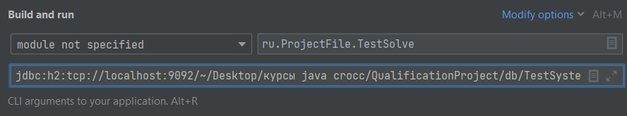
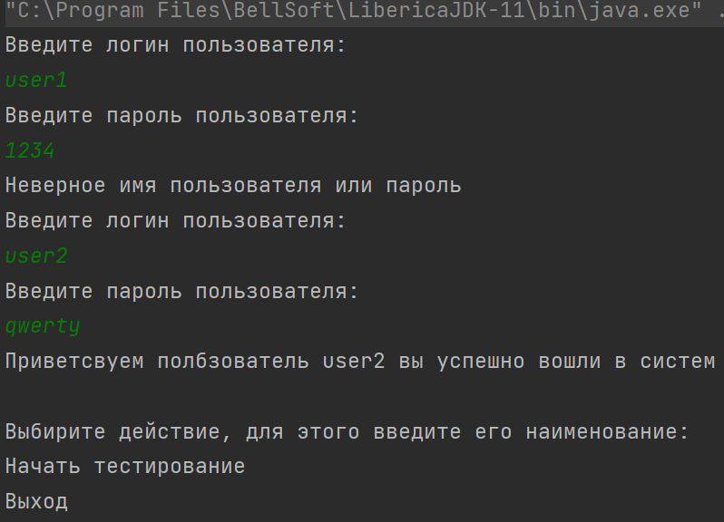
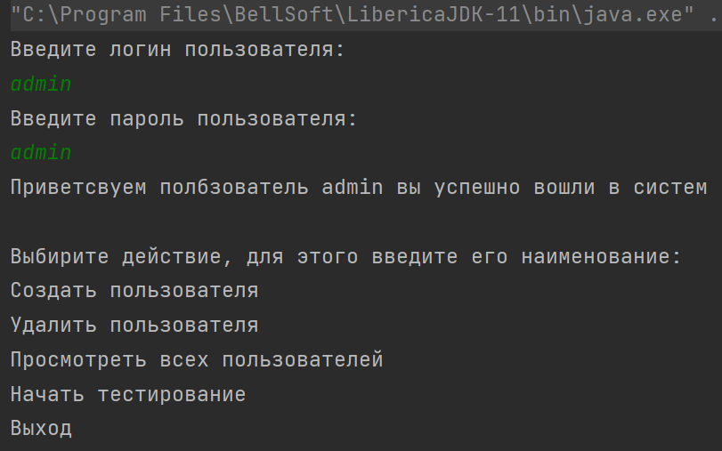
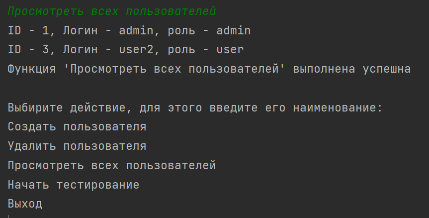
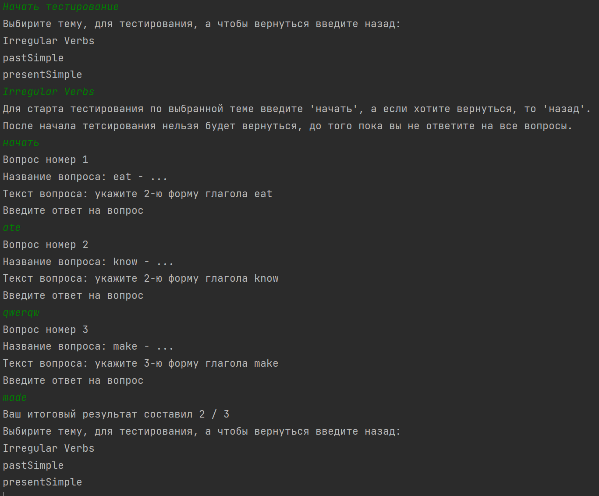

# Итоговый проект Croc Java Course

---

# Памятка по запуску приложения
 
Для запуска программы, укажите в параметрах запуска путь до файла с базой данных

После этого можно запускать программу

Сначала необходимо войти в приложение под зарегестрированном пользователем

В зависимоти от уровня доступа доступен разный набор функций

Пример пользовательского входа

Пример входа от администратора,
помимо стандартных функций доступны кастомные SQL запросы

Пример выполнение кастомной функции

Пример проведения тестирования

